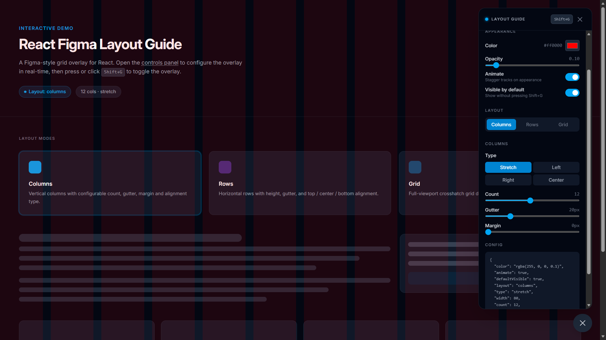

# react-figma-layout-guide playground

[](https://www.npmjs.com/package/react-figma-layout-guide)
[](https://github.com/CHR-onicles/react-figma-layout-guide/blob/main/LICENSE)
[](https://nodejs.org/)
[](https://github.com/CHR-onicles/react-figma-layout-guide/actions/workflows/test.yml)

Monorepo for:

- **react-figma-layout-guide** package: a React overlay for Figma-style column, row, and grid layout guides.
- A React Router app playground to test the component interactively.

## [Playground](https://react-figma-layout-guide.vercel.app/)



## Using the package

If you are installing the package in your own app, see this documentation:

**[packages/react-figma-layout-guide/README.md](packages/react-figma-layout-guide/README.md)** — install, imports, config, API, and keyboard shortcuts.

## Requirements

- [Node.js](https://nodejs.org/) **20** or newer.

## Getting started (development)

From the repository root:

```bash
npm install
npm run dev
```

## Working on the package

Build the package (from repo root, npm workspaces):

```bash
npm run build --workspace=react-figma-layout-guide
```

Or from the package folder:

```bash
cd packages/react-figma-layout-guide
npm run build
```

## Contributing

Issues and pull requests are welcome.

### License

[MIT](https://github.com/CHR-onicles/react-figma-layout-guide/blob/main/LICENSE)
